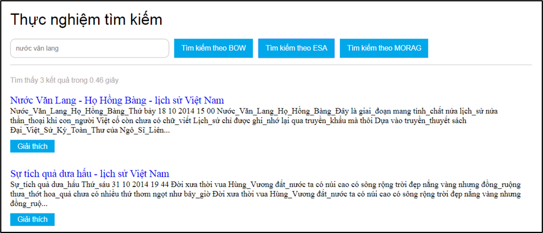

# Introduction

**Explicit semantic analysis (ESA)** is a technique in natural language processing and information retrieval for representing a piece of text as a vector in a high-dimensional space of concepts. 
It uses a document corpus, such as Wikipedia, to define a set of concepts and their relationships, and then represents a particular piece of text as a vector in this space by weighting 
the document with the concepts identified in the text. This vector representation can be used to compute the semantic relatedness between any two pieces of text, even if they have no words in common. 
ESA has been used in information retrieval, text classification, text summarization, and other applications.

(Explicit semantic analysis) – a method of representing concepts for documents by exploiting the knowledge repository from the outside (knowledge repository), 
specifically in the project, the Wikipedia data warehouse developed by two researchers. Researcher Evgeniy Gabrilovich and Shaul Markovitch work at Google's R&D department. 
From this approach, the project implements a conceptual search system applying ESA.

## Tech stack

JDK 8, Maven, Lucene, JSF Primeface


## How to get started?

```shell
mvn clean install
```

The experimental data set is taken from online newspapers with a small number, so the application does not apply the feature selection method. The experimental application includes two main interfaces:
Index management interface with functions:
1. Update parameters: update the parameters S, N, W and the path to the directory containing the index.
2. Document indexing: documents are saved as files in JSON format. For example:
`[ { "url": "http://lichsuvietnam.edu.vn/Lich-su-Viet-Nam/Ba-lan-chien-thang-quan-xam-luoc-Nguyen-Mong-1258-1285-1288-844.html", 
"title": "Ba lần chiến thắng quân xâm lược Nguyên Mông (1258 - 1285 - 1288) - lịch sử Việt Nam", 
"text": "Trong thế kỷ XIII  dân tộc Việt Nam đã lập nên những chiến công vĩ đại ba lần chiến thắng giặc Nguyên Mông … } ]`

3. Delete index: delete all created BOW and ESA indexes


Experimental search screen with the following functions:
1. Search by BOW: search on the index set BOW
2. ESA search: search on the ESA concept index
3. MORAG search: combined ESA and BOW search based on W . parameter
4. Explanation: show scores, concept vectors of documents and queries, general concepts


